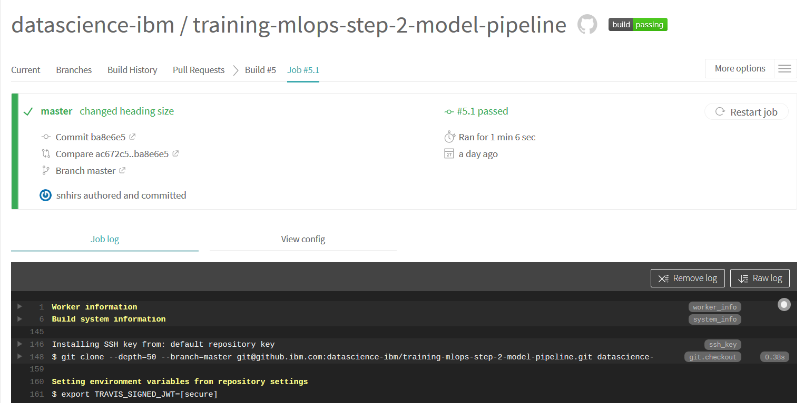

# Data Science - Best Practices &middot; [](./LICENSE.txt)

## Automation

Practicing MLOps means that you advocate for collaboration and communication between data scientists and engineers to improve **automation** to streamline repeatable machine learning end to end, including deploying to production environments. Hence automation for tasks and processes is at the very core of what MLOps is all about.

> “Give a man a fish, and you’ll feed him for a day… Integrate machine learning into your software development division and you’ll create a reactive development processes that will unite teams across your business and help achieve KPIs across all your automation projects!”

Actually, in MLOps as in DevOps practice, automation kick starts from the code generation on developers machine until the code is out to the production and even after that in monitoring the application.

We can see the automation being carried out at every phase of the development starting from triggering of the build, carrying out unit testing, packaging, deploying on to the specified environments, carrying out build verification tests, smoke tests, acceptance test cases and finally deploying on to the final production environment.

### CI / CD (and CT)

Continuous Integration and Continuous Deployment (CI/CD) are key components of any mature software development environment. During CI, newly added code is merged into the codebase, kicking off builds and automated testing. If all tests succeed, then the CD phase begins, deploying the changes automatically to production. In this way, developers can immediately release changes to production by simply committing to, or merging into, the proper branch in their version control system.

<p align="center">
     <br/>
  <sub>From <a href="https://blog.gds-gov.tech/that-ci-cd-thing-principles-implementation-tools-aa8e77f9a350">That CI/CD Thingy: Principles, Implementation & Tools</a> by <a href="https://joeir.medium.com/">Joseph Matthias Goh</a> (CC BY-NC-SA 4.0)</sub>
</p>

> The goal of CI/CD is to automatically build, test and safely deploy your application, so you can iterate quickly when developing new software.

ML and other software systems are similar in continuous integration of source control, unit testing, integration testing, and continuous delivery of the software module or the package. However, in ML, there are a few notable differences:

- CI is no longer only about testing and validating code and components, but also testing and validating data, data schemas, and models.
- CD is no longer about a single software package or a service, but a system (an ML training pipeline) that should automatically deploy another service (model prediction service).

Furthermore in MLOps the traditional CI/CD pipeline is extended with CT (Continuos Training). CT is a new property, unique to ML systems, that's concerned with automatically retraining and serving the models. Extending the traditional CI/CD pipeline with CT responds to the need to cover for the following key differences between MLOps and DevOps

- In ML systems, deployment isn't as simple as deploying an offline-trained ML model as a prediction service. ML systems can require you to deploy a multi-step pipeline to automatically retrain and deploy model. This pipeline adds complexity and requires you to automate steps that are manually done before deployment by data scientists to train and validate new models.

- ML models can have reduced performance not only due to suboptimal coding, but also due to constantly evolving data profiles. In other words, models can decay in more ways than conventional software systems, and you need to consider this degradation. Therefore, you need to track summary statistics of your data and monitor the online performance of your model to send notifications or roll back when values deviate from your expectations.

### Pipeline Design

A typical MLOps pipeline will typically consist of the following stages:

- **Development and experimentation**: You iteratively try out new ML algorithms and new modeling where the experiment steps are orchestrated. The output of this stage is the source code of the ML pipeline steps that are then pushed to a source repository.

- **Pipeline continuous integration**: You build source code and run various tests. The outputs of this stage are pipeline components (packages, executables, and artifacts) to be deployed in a later stage.

- **Pipeline continuous delivery**: You deploy the artifacts produced by the CI stage to the target environment. The output of this stage is a deployed pipeline with the new implementation of the model.

- **Automated triggering**: The pipeline is automatically executed in production based on a schedule or in response to a trigger. The output of this stage is a trained model that is pushed to the model registry.

- **Model continuous delivery**: You serve the trained model as a prediction service for the predictions. The output of this stage is a deployed model prediction service.

- **Monitoring**: You collect statistics on the model performance based on live data. The output of this stage is a trigger to execute the pipeline or to execute a new experiment cycle.

The following diagram shows the stages of the ML CI/CD automation pipeline:

<p align="center">
     <br/>
  <sub>From <a href="https://cloud.google.com/architecture/mlops-continuous-delivery-and-automation-pipelines-in-machine-learning">MLOps: Continuous delivery and automation pipelines in machine learning</a> by Google (CC BY 4.0)</sub>
</p>

### Travis CI

Travis CI is a continuous integration service that is used mostly in Github. It provides a free plan for open source projects and it is a hosted service, which means you don't have to host your own server. To learn more about Travis CI in detail follow their tutorial [here](https://docs.travis-ci.com/user/tutorial/).

#### How it works
As a continuous integration platform, Travis CI supports your development process by automatically building and testing code changes, providing immediate feedback on the success of the change.

When you run a build, Travis CI clones your GitHub repository into a brand-new virtual environment, and carries out a series of tasks to build and test your code. If one or more of those tasks fail, the build is considered broken. If none of the tasks fail, the build is considered passed and Travis CI can deploy your code to a web server or application host.

### Jenkins

Jenkins is a self-contained, open source automation server which can be used similarly to to automate all sorts of tasks related to building, testing, and delivering or deploying software. To learn more about Jenkins in detail you can find a number of tutorials [here](https://www.jenkins.io/doc/tutorials/)

Jenkins achieves Continuous Integration with the help of plugins. Plugins allows the integration of Various DevOps stages. If you want to integrate a particular tool, you need to install the plugins for that tool. For example: Git, Maven 2 project, Amazon EC2, HTML publisher etc.

#### How it works
It is pretty common when starting with Jenkins to have a single server which runs the master and all builds, however Jenkins architecture is fundamentally "Master+Agent". The master is designed to do co-ordination and provide the GUI and API endpoints, and the Agents are designed to perform the work. The reason being that workloads are often best "farmed out" to distributed servers. This may be for scale, or to provide different tools, or build on different target platforms. Another common reason for remote agents is to enact deployments into secured environments (without the master having direct access).

To operate Jenkins, pipelines are created. A pipeline is a series of steps the Jenkins server will take to perform the required tasks of the CI/CD process. These are stored in a plain text Jenkinsfile. The Jenkinsfile uses a curly bracket syntax that looks similar to JSON. Steps in the pipeline are declared as commands with parameters and encapsulated in curly brackets. The Jenkins server then reads the Jenkinsfile and executes its commands, pushing the code down the pipeline from committed source code to production runtime.

### Jenkins vs Travis CI

- **Private Project Support**: While Jenkins and TravisCI both support open source projects equally, they bifurcate when it comes to proprietary repositories. Jenkins, as an open-source tool, can be integrated with private repositories as quickly as the open-source counterparts. However, you need to upgrade to a paid version of TravisCI if you would like to build and test your private repositories on GitHub.

- **Customizability**: The next question that one may ask is about the customizability of both tools. Travis generally works well with basic tests. There are various functionalities of Travis that can be tweaked with the configuration file. However, you are limited to only the features that the Travis team provides. Jenkins, on the other hand, is highly customizable. In addition to the default features that it provides, there is a variety of plugins available for your use.

- **Technical Expertise Required**: Travis is a cloud-based implementation of a CI tool that is pretty easy to use with a user-friendly GUI. Jenkins needs a bit more technical expertise to set up and customize. However, once the initial set up is done, it is well worth the effort.

- **Costs Involved**: The costs revolve around the type of your repository. If you manage an open-source repository hosted on GitHub, Travis is free for you to build and test. Though Jenkins is free to use as well, additional hosting costs may not be feasible for a team with a limited budget.

### Examples

To find examples for these guidelines, go to the example repository: [MLOps pipeline](https://github.ibm.com/datascience-ibm/example-mlops-model-pipeline).

In this example repository we are using Travis CI to perform the continuos integration tasks in our project, such as making sure that every time a new commit is done the project is build and it can be determined whether the new commit broke something or not.

To start using Travis CI in the Github repository we must create a `travis.yml` file that tells travis what to do. We start by telling Travis about the language and the services that we are using in our project

```yaml
language: python
services:
  - docker
python:
  - "3.7"
...
```

We can then extend the `travis.yml` file with the steps that need to be taken to build the project such as updating and installing all the necessary elements to manage our environment

```yaml
language: python
services:
  - docker
python:
  - "3.7"
before_install:
  - sudo apt-get update
  - sudo apt-get -y install make
  - pip install pipenv
install:
  - make install
script:
  - make build.training
...
```

Finally we can specify all the credentials to our deployment environment such that it is prepared and running for the deployment of our application

```yaml
language: python
services:
  - docker
python:
  - "3.7"
before_install:
  # install make
  - sudo apt-get update
  - sudo apt-get -y install make
  # install pipenv
  - pip install pipenv
install:
  - make install
script:
  - make build.training
before_deploy:
  # install awscli
  - pip install awscli
  - export PATH=$PATH:$HOME/.local/bin
  # install kubectl
  - curl -LO https://storage.googleapis.com/kubernetes-release/release/`curl -s https://storage.googleapis.com/kubernetes-release/release/stable.txt`/bin/linux/amd64/kubectl
  - chmod +x ./kubectl
  - sudo mv ./kubectl /usr/local/bin/kubectl
  # Change AWS role for 15 min
  - sudo apt-get install jq
  - AWS_ROLE_SESSION_NAME=$(echo "TravisCI-owner-${TRAVIS_REPO_SLUG}-build-${TRAVIS_BUILD_NUMBER}" | sed 's/[\/]/-repo-/g')
  - AWS_JSON=$(aws sts assume-role --role-arn $AWS_ROLE_ARN --role-session-name $AWS_ROLE_SESSION_NAME --duration-seconds 900)
  - export AWS_ACCESS_KEY_ID=$(echo $AWS_JSON | jq -r '.Credentials.AccessKeyId')
  - export AWS_SECRET_ACCESS_KEY=$(echo $AWS_JSON | jq -r '.Credentials.SecretAccessKey')
  - export AWS_SESSION_TOKEN=$(echo $AWS_JSON | jq -r '.Credentials.SessionToken')
  # login Docker to AWS ECR
  - eval $(aws ecr get-login --no-include-email --region $AWS_REGION)
  # login kubectl to AWS EKS
  - aws eks --region $AWS_REGION update-kubeconfig --name $AWS_EKS_CLUSTER
deploy:
  # deploy Docker image to AWS EKS
  - provider: script
    script: make tag="${AWS_ECR_ID}.dkr.ecr.${AWS_REGION}.amazonaws.com/${AWS_ECR_REPOSITORY_TRAINING}" version=$TRAVIS_BUILD_NUMBER deploy
    on:
      branch: model
 ```

You can monitor your build through the Travis CI UI by logging with Github in [Travis-ci.com](https://travis-ci.com/). You can then via your profile select the repositories you want to sync to your account. The screenshot below shows the Travis web interface where you can monitor your build.

<p align="center">
     <br/>
  <sub>&copy; IBM</sub>
</p>
