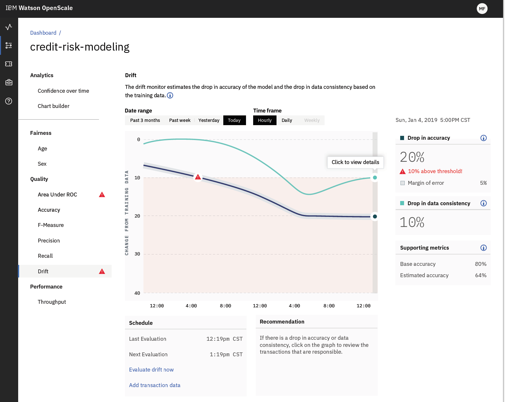
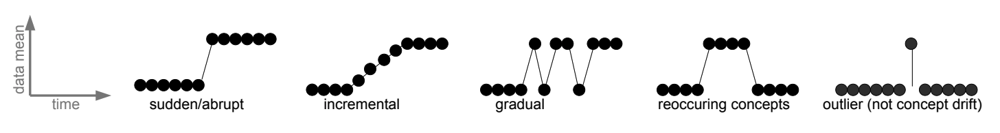

# IBM Data Science - Best Practices

## Monitoring

- Application Monitoring
  - Log Monitoring
  - SLI tracking (up-time, response time, etc.)

### Model Monitoring

Now that the model is live, we need to understand how it performs in production and close the data feedback loop. This is important due to two reasons: a) Ensuring the model is still valid (even with time passing) and b) Detecting (temporary) unusual behavior. Tools for log aggregation and metrics collection are usually used to capture data from a live system such as business KPIs, software reliability and performance metrics, debugging information for troubleshooting, and other indicators that could trigger alerts when something goes out of the ordinary. We can also leverage these same tools to capture data to understand how our model is behaving such as:

> As Einstein is rumored to have said, theory and practice are the same, in theory. In practice, they are different. So it is with models.

- **Model inputs**: what data is being fed to the models, giving visibility into any training-serving skew. 
- **Model interpretability outputs**: metrics such as model coefficients, SHAP, or LIME outputs that allow further investigation to understand how the models are making predictions to identify potential overfit or bias that was not found before deployment.
- **Model outputs and decisions**: what predictions our models are making given the production input data, and also which decisions are being made based on those predictions. Sometimes the application might choose to ignore the model and make a decision based on pre-defined rules (or to avoid future bias).
- **User action and rewards**: based on further user action, we can capture reward metrics to understand if the model is having the desired effect. For example, if we display product recommendations, we can track when the user decides to purchase the recommended product as a reward.
- **Model fairness**: analysing whether the model is discriminating against sensitive attributes such as race, gender, age, income groups, etc.

The are many open and enterprise tools for model monitoring. One such open source alternative is [Kibana](https://www.elastic.co/kibana). Another alternative on the enterprise side is [IBM Watson OpenScale](https://www.ibm.com/cloud/watson-openscale/drift) which covers not only general metric and log functions but also has tools for identifying bias and improve model interpretability.


<p align="center">
     <br/>
  <sub>&copy; IBM</sub>
</p>

The following sections will go into more detail on some of the most relevant elements of model monitoring and how those insights can be used to inform decisions about model retraining, data collection and other model improvements. Moreover we also cover methods and techniques regarding model bias and interpretability and how you may use them in your projects.

#### Concept drift

Concept drift in machine learning and data mining refers to the change in the relationships between input and output data in the underlying problem over time. What is especially important for us is to monitor and track the performance of our models such that if we see a marked decrease in expected performance we are alerted of it. 

<p align="center">
     <br/>
  <sub>&copy; 20th Century Fox</sub>
</p>

Concept drift is very common in productive systems, e.g. sensors wearing out over time, productions layouts changing or the predictions we are issuing changing the environment itself; For instance, imagine a predictive policing model indicating the neighborhoods in a city with the most criminal activities. The local police will accordingly reinforce their presence in this area which results in a decreasing criminal statistic over time. This development, however, will invalidate the recommendations of the predictive service which continues to classify this neighborhood as a high-risk area.

> One of the main objectives of model monitoring is to inform your (re) training strategy. If your performance is smoothly dropping every month then it might be an indication that the underlying process you are trying to model is changing faster than the model is able to capture it.

Furthermore it is important to understand that concept drift does not necessarily happen smoothly over time. In general we can think of drift being caused typically by either of the following changes:

<p align="center">
   <br/>
  <sub>Gama, J., Žliobaitė, I., Bifet, A., Pechenizkiy, M., & Bouchachia, A. (2014). A survey on concept drift adaptation. ACM computing surveys (CSUR), 46(4), 1-37.</sub>
</p>

The detection of concept drift, however, is a challenge. Typical concept drift detectors are, among others:

- [The Page Hinkley Test](https://www.win.tue.nl/~mpechen/publications/pubs/Gama_ACMCS_AdaptationCD_accepted.pdf)
- [Adaptive Sliding Window (ADWIN)](https://www.win.tue.nl/~mpechen/publications/pubs/Gama_ACMCS_AdaptationCD_accepted.pdf)
- [Error Intersection Approach (EIA)](https://arxiv.org/pdf/2004.00438.pdf)

Once we have identified concept drift, different handling schemes may be required for each situation. Often, recurring change and long-term trends are considered systematic and can be explicitly identified and handled. Below is a list with some of the methods and techniques you can use to mitigate and control for concept drift:

- **Do Nothing (Static Model)** The most common way is to not handle it at all and assume that the data does not change. This should be your starting point and baseline for comparison to other methods. If you believe your dataset may suffer concept drift, you can use a static model in two ways:
  - Concept Drift Detection. Monitor skill of the static model over time and if skill drops, perhaps concept drift is occurring and some intervention is required.
  - Baseline Performance. Use the skill of the static model as a baseline to compare to any intervention you make.

- **Periodically Re-Fit** A good first-level intervention is to periodically update your static model with more recent historical data. For example, perhaps you can update the model each month or each year with the data collected from the prior period. This may also involve back-testing the model in order to select a suitable amount of historical data to include when re-fitting the static model. In some cases, it may be appropriate to only include a small portion of the most recent historical data to best capture the new relationships between inputs and outputs (e.g. the use of a sliding window).

- **Periodically Update** Some machine learning models can be updated. This is an efficiency over the previous approach (periodically re-fit) where instead of discarding the static model completely, the existing state is used as the starting point for a fit process that updates the model fit using a sample of the most recent historical data. For example, this approach is suitable for most machine learning algorithms that use weights or coefficients such as regression algorithms and neural networks.

- **Weight Data** Some algorithms allow you to weigh the importance of input data. In this case, you can use a weighting that is inversely proportional to the age of the data such that more attention is paid to the most recent data (higher weight) and less attention is paid to the least recent data (smaller weight). This is effectively the same as monitoring the monitoring of your feature importance metrics.

- **Learn The Change** An ensemble approach can be used where the static model is left untouched, but a new model learns to correct the predictions from the static model based on the relationships in more recent data. This may be thought of as a boosting type ensemble (in spirit only) where subsequent models correct the predictions from prior models. The key difference here is that subsequent models are fit on different and more recent data, as opposed to a weighted form of the same dataset, as in the case of AdaBoost and gradient boosting.

- **Detect and Choose Model** For some problem domains it may be possible to design systems to detect changes and choose a specific and different model to make predictions. This may be appropriate for domains that expect abrupt changes that may have occurred in the past and can be checked for in the future. It also assumes that it is possible to develop skillful models to handle each of the detectable changes to the data. For example, the abrupt change may be a specific observation or observations in a range, or the change in the distribution of one or more input variables.

However, all these methods require that you gain true labels within the productive environment. If this is not the case, more advanced methods are necessary, e.g. a precise monitoring of the input data.

#### Model Bias and Fairness

A simple answer to the presence of bias is that it’s a result of the data, but the origins are more subtle and related to the source of data, the contents of the data (does it include elements that the model should be ignorant of?), and the training of the model itself (for example, how do we define good and bad in the context of a model’s classification). The more common types of bias are presented next:

- **Sample Bias** A data set might not represent the problem space (such as training an autonomous vehicle with only daytime data).
- **Prejudicial Bias** A data set can also incorporate data that might not be valid to consider (for example, a person’s race or gender).
- **Exclusion bias** This occurs when we remove features that we think are not relevant.
- **Measurement bias** Occurs when the data collected for training differs from the data collected during production. This can occur when your data set is collected with a specific type of camera, but your production data comes from a camera with different characteristics.
- **Algorithmic bias** Which stems not from the data that a model was trained from but from the machine learning model itself. This includes how the model was developed or how the model was trained that results in unfair outcomes.

IBM has developed the [AI Fairness 360](https://github.com/IBM/AIF360) Toolkit to help practioners understand and mitigate bias in their ML projects. It provides access to many state of the art bias and fairness mitigation and identification techniques and it is fully open source.

Furthermore, IBM researchers have also proposed a bias rating system for machine learning models in [Towards Composable Bias Rating of AI Services.](https://arxiv.org/pdf/1808.00089.pdf) This envisions a third-party rating system for the validation of machine learning models for bias.

#### Model Interpretability / Explainability

The need for interpretability arises from an incompleteness in problem formalization, which means that for certain problems or tasks it is not enough to get the prediction (the what). The model must also explain how it came to the prediction (the why), because a correct prediction only partially solves your original problem.

Furthermore regulatory considerations such as GDPR will make it increasingly important for business that make decisions based on ML models to explain the decisions made by the model. One such example is that in February 2019 Polish government added an amendment to a banking law that gives a customer a right to receive an explanation in case of a negative credit decision. It’s one of the direct consequences of implementing GDPR in EU. This means that a bank needs to be able to explain why the loan wasn’t granted if the decision process was automatic.

<p align="center">
     <br/>
  <sub>From <a href="https://christophm.github.io/interpretable-ml-book/terminology.html">Interpretable Machine Learning - A Guide for Making Black Box Models Explainable.</a> by <a href="https://christophm.github.io/">Christoph Molnar (CC BY-NC-SA 4.0)</a></sub>
</p>

To interpret a model, we require the following insights :

- Features in the model which are most important.
- For any single prediction from a model, the effect of each feature in the data on that particular prediction.
- Effect of each feature over a large number of possible predictions

There are a number of techniques you can use to help interpretation of your model such as:

- **Permutation Importance** Permutation Importance works for many scikit-learn estimators. The idea is simple: Randomly permutate or shuffle a single column in the validation dataset leaving all the other columns intact. A feature is considered “important” if the model’s accuracy drops a lot and causes an increase in error. On the other hand, a feature is considered ‘unimportant’ if shuffling its values don’t affect the model’s accuracy. The python library ELI5 can be used to perform permutation importance as follows

``` python
import eli5
from eli5.sklearn import PermutationImportanceperm = PermutationImportance(my_model, random_state=1).fit(val_X, val_y)
eli5.show_weights(perm, feature_names = val_X.columns.tolist())
```

- **Partial Dependence Plots** The partial dependence plot (short PDP or PD plot) shows the marginal effect one or two features have on the predicted outcome of a machine learning model. PDPs show how a feature affects predictions. PDP can show the relationship between the target and the selected features via 1D or 2D plots. The python library PDPbox can be used to generate these plots as follows

``` python
from matplotlib import pyplot as plt
from pdpbox import pdp

pdp_goals = pdp.pdp_isolate(model=my_model, dataset=val_X, model_features=feature_names, feature='Goal Scored')# plot it
pdp.pdp_plot(pdp_goals, 'Goal Scored')
plt.show()
```

- **LIME** Local interpretable model-agnostic explanations (LIME) is a method that focuses on the implementation of local surrogate models. Instead of training a global surrogate model, LIME focuses on training local surrogate models to explain individual predictions. LIME tests what happens to the predictions when you give variations of your data into the machine learning model. LIME generates a new dataset consisting of permuted samples and the corresponding predictions of the black box model. On this new dataset LIME then trains an interpretable model, which is weighted by the proximity of the sampled instances to the instance of interest.

- **SHAP Values** SHAP which stands for SHapley Additive exPlanation, helps to break down a prediction to show the impact of each feature. It is based on Shapley values, a technique used in game theory to determine how much each player in a collaborative game has contributed to its success. Normally, getting the trade-off between accuracy and interpretability just right can be a difficult balancing act but SHAP values can deliver both. You can use the python library [SHAP](https://github.com/slundberg/shap) to start working with SHAP values.

Furthermore, like with Bias and Fairness IBM has buit a toolkit called [AI Explainability 360](https://github.com/IBM/AIX360) which is an open-source library that supports interpretability and explainability of datasets and machine learning models. The AI Explainability 360 Python package includes a comprehensive set of algorithms that cover different dimensions of explanations along with proxy explainability metrics.

Another great open source catalogue of explainability related methods and frameworks can be found [here](https://github.com/EthicalML/awesome-production-machine-learning)

### Notification Systems

### Examples

To find examples for these guidelines, go to the example repository: [MLOps pipeline](https://github.ibm.com/datascience-ibm/example-mlops-model-pipeline).

In this implementation all the relevant metrics are pushed to AWS S3 from where they can be accessed.
In the makefile the test coverage results are copied to a S3 bucket:

```make
upload.monitoring: test
	pipenv run aws s3 cp ./build/unittest-coverage.json s3://machine-learning-metrics/trainer/unittest-coverage/unittest-coverage-$(version).json
	pipenv run aws s3 cp ./build/test-coverage.json s3://machine-learning-metrics/trainer/test-coverage/test-coverage-$(version).json
```

From this bucket, the results can be accessed via a SaaS: AWS QuickSight. The tool is a reporting solution, which can directly access JSON files from AWS S3.
As the coverage files are pushed for every build and a specific version, they can be viewed over time and version in the report.
AWS QuickSight offers multiple standard reports, that visualize the input.  
