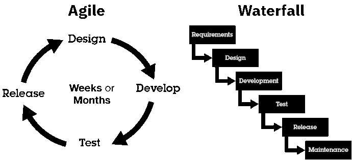
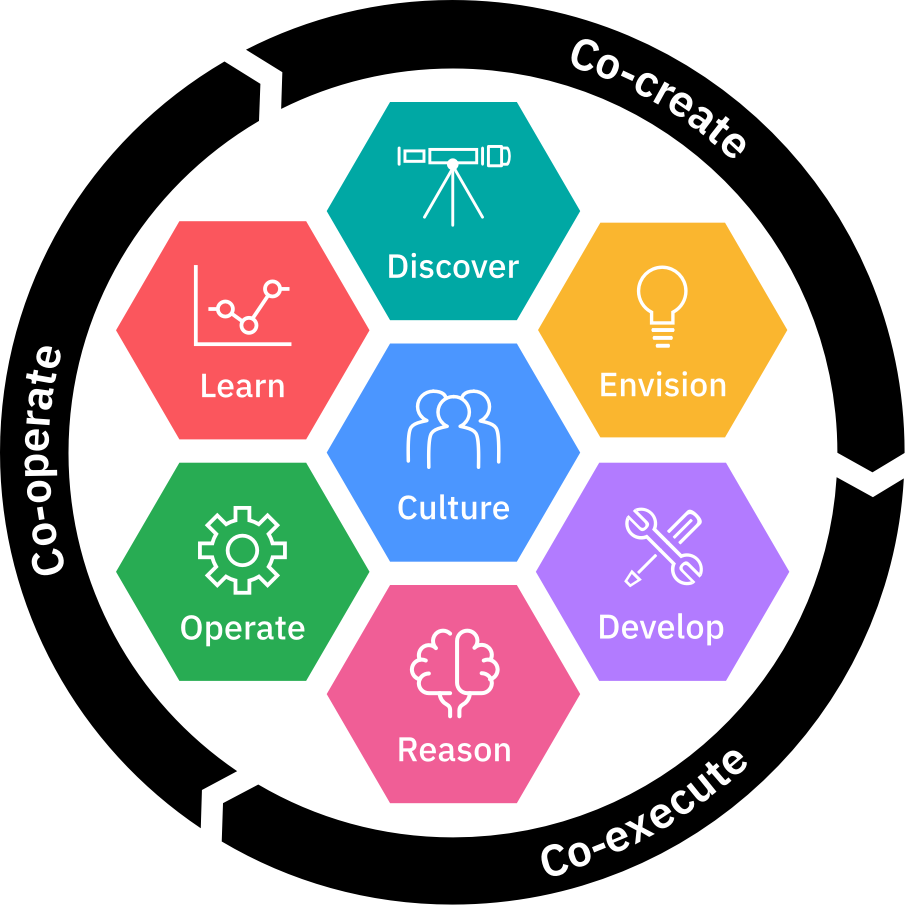

# IBM Data Science - Best Practices

## Project Team

In a typical data science project, you'll find different roles performing different work. These roles must work together as one team. To do so, it is favourable when their skills overlap: Role A knows a bit about the core skill of role B and vice versa which enables them to talk about each other's topic.

Roles themselves are a collection of skills, tasks, and responsibilities. On a project, a person / team member fulfils a certain [role](./project_roles.html). However, a person may fulfil also more than 1 role, or a role may be fulfilled by more than 1 person.

## Project Organisation

When multiple people work together on something, it's always good to have a good organisation and a clear way of working together.
This allows to work more efficient and achieve more.
The industry standard for software development (of which AI / Data Science is a special form) are agile / iterative approaches.

> **Agile vs. Waterfall**
>
> In the past software had been developed in a Waterfall approach.
> In a Waterfall approach the whole project is planned at the beginning and afterwards each step on the project plan is executed in the earlier defined order.
> Therefore, the tasks trickle down like a waterfall, hence the name.
> The key issue  with a Waterfall approach is that it relies heavily on the assumption that all steps of the project incl. its efforts can be planned and estimated in the beginning of the project.
> A lot of software projects have shown that this is hardly possible, especially in Data Science or AI projects it is very hard to tell how quickly the team will arrive at an acceptable model performance.
> Which is why Waterfall is almost  never used to manage Data Science or AI related projects.
>
> In Agile software development only a short increment of a fixed timeframe e.g., 2 or 4 weeks, is planned and estimated.
> Once the increment time is over the results achieve within this fixed timeframe are reviewed.
> Based on the findings and overall progress the next increments are planned and executed from there.
> This is repeated till a desired state is achieved.
> Because this approach gives a lot of room for adjustments it's considered more agile, hence the name.
> And because it works with an iteration of time-boxed increments, it's named iterative approach.
>
> Why do some organisations still insist on waterfall?
> The key advantage of waterfall is that it gives (on paper) a complete plan with a clearly defined output delivered at a clearly defined point in time with clearly defined costs, under the assumption that all the assumptions and estimations are correct.
> Agile on the other side doesn't promise any results; a fixed capacity (cost) for a fixed amount of time is spend and the team tries to get as far as possible.
> From a buyer's perspective this creates risk on their side, which they naturally would like to avoid.
> On average however, agile software development projects are [more successful](https://vitalitychicago.com/blog/agile-projects-are-more-successful-traditional-projects/) than waterfall based ones.
> 

>       
>    &copy; <a href="https://www.ibm.com/garage/method/practices/culture/practice_evolve_to_continuous_delivery/">IBM</a>
>  

More details on Agile methodology:

- [The Agile Method: Everything you need to know](https://developer.ibm.com/articles/agile-method-everything-you-need-to-know/)
- [Agile at IBM](https://agile-academy.yourlearning.ibm.com/#/Home) (IBM Internal)
- Agile for Dummies, eBook

### IBM Garage Model

Agile focuses a lot on team collaboration, which makes it perfect for small teams.
If the team gets too large, collaboration between all team members becomes a massive overhead and the performance of the agile team overall drops.
There is no exact team limit defined, but around 10 people is the rough guidance:

- SAFe (Scaled Agile Framework) defines a team as [5 - 11 individuals](https://www.scaledagileframework.com/agile-teams/).
- Amazon applies the [2 pizza rule](https://www.theguardian.com/technology/2018/apr/24/the-two-pizza-rule-and-the-secret-of-amazons-success).
- According to [Google re:work](https://rework.withgoogle.com/guides/understanding-team-effectiveness/steps/identify-dynamics-of-effective-teams/), team size was not a deciding factor on team effectiveness at Google, however other research showed that small team (less than 10) performed better.

Since most software projects (including Data Science and AI project) require more than 10 people, additional frameworks on top of the agile basis were built.
IBMs standard approach for scaling agile is the [IBM Garage](https://www.ibm.com/garage).

      
    IBM Garage Model&copy; IBM

- [IBM Garage Methodology](https://www.ibm.com/garage/method)
- [IBM Garage Field Guide](https://www.ibm.com/cloud/architecture/files/ibm-garage-field-guide.pdf)
- [IBM Garage](https://ibm.biz/ibmgarage) (IBM Internal)

The [Scaled Agile Framework (SAFe)](https://www.scaledagileframework.com/) is an alternative framework for scaling out agile teams and coordinating them.

### Scaled Data Science Method

Both agile and IBM Garage define very little about the actual content of the project and which specific steps should be taken; in a sense both are empty shells to be filled with content of the project at hand.
The key reason is their general character; they are applicable for all kinds of software projects e.g., mobile, mainframe, data science or AI development.

To address this gap IBM leverages the Scaled Data Science method. Scaled Data Science combines the best of various approaches and method from different areas of Data Science and software development, such as SOA (Service-Oriented Architecture), microservices architecture, DevSecOps, CRISP-DM, Test-Driven Development, Enterprise Design Thinking for Data and AI and Ethics By Design, all encased by the IBM Garage.

      
    Scaled Data Science Method &copy; IBM

For a very small setup with a single agile team the Scaled Data Science method can still be leveraged - obviously the IBM Garage shell is skipped in this case.

> **Why not pure CRISP-DM**
>
> [CRISP-DM (Cross-industry standard process for data mining)](https://en.wikipedia.org/wiki/Cross-industry_standard_process_for_data_mining) was invented in the 1990s with the aim to organise how Data Mining is done.
> Some organisations have tried to re-use the same approach for Data Science with semi-success.
> The difference between Data Mining and Data Science is that Data Mining is focused on gaining insights for the "miner"  (typically a modern Data Scientist).
> Most Data Science solutions focus on providing insights to a process or an end-user, not the data scientists themselves.
> Therefore CRISP-DM stops after gaining that insight, whereas the Scaled Data Science method focuses additionally on the integration of the model into an end-to-end solution, so that the insights of the model are ultimately part of the business process and reach the end-user(s).
>
> 

>       
>     <a href="https://en.wikipedia.org/wiki/Cross-industry_standard_process_for_data_mining#/media/File:CRISP-DM_Process_Diagram.png">CRISP-DM by Kenneth Jensen / WikiMedia (CC-SA-BY)</a>; Scaled Data Science Method &copy; IBM
> 

More Details:

- [Scaled Data Science on MethodWorkspace](https://methodworkspace-prod.dal1a.cirrus.ibm.com/search?modalId=Method__MYmA67659568-3ebc-4941-b1bc-7c21255b7c5d&methodType=original) (IBM Internal)
- [Scaled Data Science Webinar](https://w3.ibm.com/services/lighthouse/spotlight/videos/96411) (IBM Internal)
- [SOA](https://www.ibm.com/cloud/learn/soa) & [Microservice Architecture](./architecture.html#micro-services-architecture)
- [DevSecOps](https://www.ibm.com/cloud/learn/devsecops)
- [CRISP-DM](https://en.wikipedia.org/wiki/Cross-industry_standard_process_for_data_mining)
- [Test-Driven Development](https://www.ibm.com/garage/method/practices/code/practice_test_driven_development/)
- [Enterprise Design Thinking](https://www.ibm.com/design/thinking/)
- [Enterprise Design Thinking for Data and AI](https://w3.ibm.com/w3publisher/ai-strategy/ai-strategy-with-customers/edt-for-data-ai) (IBM Internal)
- [Ethics By Design](https://w3.ibm.com/w3publisher/ai-ethics/ethics-by-design) (IBM Internal)
