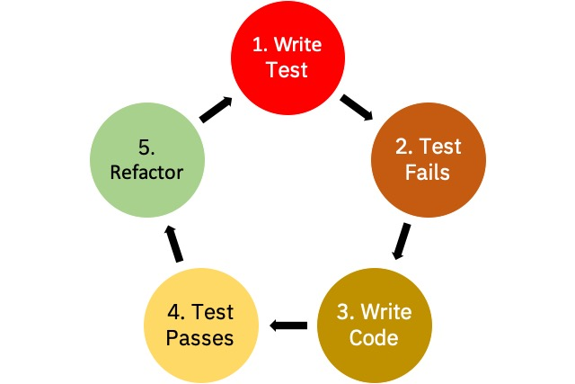

# IBM Data Science - Best Practices

## Testing

Errors made by us humans, when executed can lead to software failures. Some errors and mistakes are minor but some are quite dangerous and require constant evaluation and monitoring. Therefore, it has become vital for software engineers to implement testing throughout the software life cycle, to ensure the efficiency of the developed software as well as to verify that no defects or bugs are left undetected, as they can hamper the intended quality, effectiveness, and performance of the software. Moreover, testing is a process that helps measure the quality of the software and gives confidence in it. The process of testing should always be automated.

### Unit testing

#### Basics / Intro

Unit testing is a method where components or individual units of software are tested to determine their conformity to the designed specifications, and that also includes testing associated data and usage procedures. A unit is simply a small piece of code for any single function. The unit test itself is a short script or piece of code designed to verify the behavior of a particular unit to produce a pass or fail result.

One tool you may use to write your unit tests in python is `unittest`which is a unit testing framework that was originally inspired by JUnit and has a similar flavor as major unit testing frameworks in other languages. It supports test automation, sharing of setup and shutdown code for tests, aggregation of tests into collections, and independence of the tests from the reporting framework. You can learn more about it [here](https://docs.python.org/3/library/unittest.html).

The following is an example for writting unit tests using `unittest` to test three string methods:

``` python

import unittest

class TestStringMethods(unittest.TestCase):

    def test_upper(self):
        self.assertEqual('foo'.upper(), 'FOO')

    def test_isupper(self):
        self.assertTrue('FOO'.isupper())
        self.assertFalse('Foo'.isupper())

    def test_split(self):
        s = 'hello world'
        self.assertEqual(s.split(), ['hello', 'world'])
        # check that s.split fails when the separator is not a string
        with self.assertRaises(TypeError):
            s.split(2)

if __name__ == '__main__':
    unittest.main()
```

#### Edge Testing

An edge case typically involves input values that require special handling in an algorithm behind a computer program. As a measure for validating the behavior of computer programs in such cases; they are testing boundary conditions of an algorithm, function or method. A series of edge cases around each "boundary" can be used to give reasonable coverage and confidence using the assumption that if it behaves correctly at the edges, it should behave everywhere else.

For example, a function that divides two numbers might be tested using both very large and very small numbers. This assumes that if it works for both ends of the magnitude spectrum, it should work correctly in between.

#### Mocking

An object under test may have dependencies on other (complex) objects. To isolate the behavior of the object you want to replace the other objects by mocks that simulate the behavior of the real objects. This is useful if the real objects are impractical to incorporate into the unit test.

If an object has any of the following characteristics, it may be useful to use a mock object in its place:

- the object supplies non-deterministic results (e.g. the current time or the current temperature);
- it has states that are difficult to create or reproduce (e.g. a network error);
- it is slow (e.g. a complete database, which would have to be initialized before the test);
- it does not yet exist or may change behavior;
- it would have to include information and methods exclusively for testing purposes (and not for its actual task).

### Integration / Component Testing

Integration testing is a level of software testing where individual units (unit tests) are combined and tested as a group. The purpose of this level of testing is to expose faults in the interaction between integrated units. There are a number of approaches to run your integration tests, below we present some of the most commonly used:

- **Big Bang** is an approach to Integration Testing where all or most of the units are combined together and tested at one go. This approach is taken when the testing team receives the entire software in a bundle. So what is the difference between Big Bang Integration Testing and System Testing? Well, the former tests only the interactions between the units while the latter tests the entire system.
- **Top Down** is an approach to Integration Testing where top-level units are tested first and lower level units are tested step by step after that. This approach is taken when top-down development approach is followed. Test Stubs are needed to simulate lower level units which may not be available during the initial phases.
- **Bottom Up** is an approach to Integration Testing where bottom level units are tested first and upper-level units step by step after that. This approach is taken when bottom-up development approach is followed. Test Drivers are needed to simulate higher level units which may not be available during the initial phases.
- **Sandwich/Hybrid** is an approach to Integration Testing which is a combination of Top Down and Bottom Up approaches.

### System Testing (End-2-End)

System testing is a level of testing that validates the complete and fully integrated software product. The purpose of a system test is to evaluate the end-to-end system specifications. Usually, the software is only one element of a larger computer-based system. Ultimately, the software is interfaced with other software/hardware systems. System Testing is actually a series of different tests whose sole purpose is to exercise the full computer-based system.

### Data Testing

Machine learning systems differ from traditional software-based systems in that the behavior of MLsystems is not specified directly in code but is learned from data. Therefore, while traditional software can rely on unit tests and integration tests of the code, here we attempt to add a sufficient set of tests of the data.

- **Test that the distributions of each feature match your expectations**. One example might be to test that Feature A takes on values 1 to 5, or that the two most common values of Feature B are"Harry" and "Potter" and they account for 10% of all values. This test can fail due to real external changes, which may require changes in your model.
- **Test the relationship between each feature and the target, and the pairwise correlations between  individual  signals**. It  is  important  to  have  a  thorough  understanding  of  the  individual features used in a given model; this is a minimal set of tests, more exploration may be needed to develop a full understanding.  These tests may be run by computing correlation coefficients, by training models with one or two features, or by training a set of models that each have one of k features individually removed.
- **Test the cost of each feature**.The costs of a feature may include added inference latency and RAM usage, more upstream data dependencies, and additional expected instability incurred by relying on that feature.  Consider whether this cost is worth paying when traded off against the provided improvement in model quality.
- **Test that a model does not contain any features that have been manually determined as unsuitable for use**. A feature might be unsuitable when it’s been discovered to be unreliable, overly expensive,etc. Tests are needed to ensure that such features are not accidentally included (e.g. via copy-paste) into new models.
- **Test that your system maintains privacy controls across its entire data pipeline**. While strict access control is typically maintained on raw data, ML systems often export and transform that data during training. Test to ensure that access control is appropriately restricted across the entire pipeline.
- **Test all code that creates input features, both in training and serving**.It can be tempting to believe feature creation code is simple enough to not need unit tests, but this code is crucial for correct behavior and so its continued quality is vital.

Several methods can be used to validate that the data going into the model is correct and aligned with expectations. It is particularly important to continue to validate and test incoming data during production to ensure that our models continue to perform and it can also serve as an indication or trigger that the model needs to be re-trained because the distribution or nature of the data has changed.

#### Data consistency tests

- **Schema Based Example Validation** identifies any anomalies in the input data by comparing data statistics against a schema. The schema codifies properties which the input data is expected to satisfy, such as data types or categorical values, and can be modified or replaced by the user.

- **Training-Scoring Skew Detection** refers to the potential differences that might exist between the data used for training and the data used when scoring the model. There 4 main types of skew:
  - *Schema Skew* occurs when the training and serving data do not conform to the same schema. As the schema describes the logical properties of the data, the training as well as serving data are expected to adhere to the same schema. Any expected deviations between the two (such as the label feature being only present in the training data but not in serving) should be specified through environments field in the schema.
  - *Feature Skew* occurs when the feature values that a model trains on are different from the feature values that it sees at serving time. This can happen due to multiple reasons, including:
    - If an external data source that provides some feature values is modified between training and serving time.
    - Inconsistent logic for generating features between training and serving. For example, if you apply some transformation only in one of the two code paths.
  - *Distribution Skew* occurs when the distribution of feature values for training data is significantly different from serving data. One of the key causes for distribution skew is using either a completely different corpus for training data generation to overcome lack of initial data in the desired corpus. Another reason is a faulty sampling mechanism that only chooses a subsample of the serving data to train on.
  - *Scoring/Serving Skew* is harder to detect and occurs when only a subset of the scored examples are actually served. Since labels are only available for the served examples and not the scored examples, only these examples are used for training. This implicitly causes the model to mispredict on the scored examples since they are gradually underrepresented in the training data.

#### Content tests for ML Models

Monitoring is crucial for models that automatically incorporate new data in a continual or ongoingfashion at training time, and is always needed for models that serve predictions in an on-demand fashion.

- **Test for model staleness**. For models that continually update, this means monitoring staleness throughout the training pipeline, to be able to determine in the case of a stale model where the pipeline has stalled. For example, if a daily job stopped generating an important table, what alert would fire?
- **Test for NaNs or infinities appearing in your model during training or scoring**. Invalid numericvalues can easily crop up in your learning model, and knowing that they have occurred can speed diagnosis of the problem.
- **Test for dramatic or slow-leak regressions in training speed, serving latency, throughput, or RAM usage**. The computational performance (as opposed to predictive quality) of an ML system is often a key concern at scale, and should be monitored via specialized regression testing. Dramatic regressions and slow regressions over time may require different kinds of monitoring.
- **Test for regressions in prediction quality on served data**. For many systems, monitoring for non-zero bias can be an effective canary for identifying real problems, though it may also result fromchanges in the world.

#### Unit tests for ML Models

Given the fact that we have problems such as unstable data, underfitted models, overfitted models, and uncertain future resiliency, what should we do? There are some general guidelines and techniques, known as heuristics, that we can write into tests to mitigate the risk of these issues arising.

##### Seam testing

Data will flow into a machine learning algorithm and flow out of the algorithm. We can test those two seams by unit testing our data inputs and outputs to make sure they are valid within our given tolerances. For example, let’s say that you would like to test a neural network. You know that the data that is yielded to a neural network needs to be between 0 and 1 and that in your case you want the data to sum to 1

```plaintext
it 'needs to be between 0 and 1' do
  @weights = NeuralNetwork.weights
  @weights.each do |point|
    (0..1).must_include(point)
  end
end

it 'has data that sums up to 1' do
  @weights = NeuralNetwork.weights
  @weights.reduce(&:+).must_equal 1
end
```

##### Testing the Speed of Training

A good proxy for complexity in a machine learning model is how fast it takes to train it. If you are testing different approaches to solving a problem and one takes 3 hours to train while the other takes 30 minutes, generally speaking the one that takes less time to train is probably better. The best approach would be to wrap a benchmark around the code to find out if it’s getting faster or slower over time.

```plaintext
it 'should not run too much slower than last time' do
  bm = Benchmark.measure do
    model.run('sentence')
  end
  bm.real.must_be < (time_to_run_last_time * 1.2)
end
```

### White Box vs. Black Box Testing

#### Black Box

In Black-box testing, a tester doesn't have any information about the internal working of the software system. Black box testing is a high level of testing that focuses on the behavior of the software. It involves testing from an external or end-user perspective. Black box testing can be applied to virtually every level of software testing: unit, integration, system, and acceptance.

The following represents some of the techniques which could be used to perform blackbox testing on machine learning models:

- Model performance
- Metamorphic testing
- Dual coding
- Coverage guided fuzzing
- Comparison with simplified, linear models
- Testing with different data slices

You can read some more details about these techniques [here](https://vitalflux.com/blackbox-testing-machine-learning-models/)

#### White Box

White-box testing is a testing technique which checks the internal functioning of the system. In this method, testing is based on coverage of code statements, branches, paths or conditions. White-Box testing is considered as low-level testing. It is also called glass box, transparent box, clear box or code base testing. The white-box Testing method assumes that the path of the logic in a unit or program is known.

#### Differences

The key differences between the two are:

- Black Box, testing is done without the knowledge of the internal structure of program or application whereas in White Box, testing is done with knowledge of the internal structure of program.
- Black Box test doesn’t require programming knowledge whereas the White Box test requires programming knowledge.
- Black Box testing has the main goal to test the behavior of the software whereas White Box testing has the main goal to test the internal operation of the system.
- Black Box testing is focused on external or end-user perspective whereas White Box testing is focused on code structure, conditions, paths and branches.
- Black Box test provides low granularity reports whereas the White Box test provides high granularity reports.
- Black Box testing is a not time-consuming process whereas White Box testing is a time-consuming process.

### Test-Driven Development



The practice of TDD involves writing a failing test, writing the code that makes it pass, and then refactoring the original code. Some people call it “red-green-refactor” after the colors of many testing libraries. Red is writing a test that doesn’t work originally but documents what your goal is, while green involves making the code work so the test passes. Finally, you refactor the original code to work so that you are happy with its design.

> Testing has always been a mainstay in the traditional development practice, but TDD emphasizes testing first instead of testing near the end of a development cycle.

Part of the reason why TDD is so appealing is that it syncs well with people and their working style. The process of hypothesizing, testing, and theorizing makes it very similar to the scientific method. ust as with the scientific method, writing tests first works well with machine learning code.

Most machine learning practitioners apply some form of the scientific method, and TDD forces you to write cleaner and more stable code. Beyond its similarity to the scientific method, though, there are three other reasons why TDD is really just a subset of the scientific method: making a logical proposition of validity, sharing results through documentation, and working in feedback loops.

### Code Style Checking

During every build a code style check should be run to ensure the [defined code style](./source_code.md#python-style-guide) is enforced. A recommended tool to check the formatting is [`yapf`](https://pypi.org/project/yapf/0.29.0/).

```shell
# check all Python files to meet the Google Python Style Guide excecpt in .venv folder
yapf -d -r --style google -vv -e .venv .
```

### Examples

To find examples for these guidelines, go to the example repository: [MLOps pipeline](https://github.ibm.com/datascience-ibm/example-mlops-model-pipeline).

The tests in this case are located in the `tests/` folder for the respective module: model and training.

In `tests/model` there are two unit test files: `classifier.py` and `datamodel.py`.
These files contain the single unit test cases, with each test case represented as one function:

```python
def test_predict(self, get_data, bytes_io, joblib_load):
        get_data.return_value = b''
        
        ...
```

```python
def test_bad_result(self, get_data, bytes_io, joblib_load):
        get_data.return_value = b''
        bytes_io.return_value = ''
        
        ...
```

The functions are testing specific units of the classifier code. The class is inheriting from `unitest.TestCase`, which builds the basis for unit test functionality.
The unit tests assert for a certain condition: e.g `self.assertEqual(prediction, Prediction.BENIGN)`.
This way these unit tests can be run automatically by the build server and yield a positive or negative result informing the developer about the functionality of the specific unit.
The build server can be configured to break the build, when on of these test cases fails, so it is not continued any further.

The file `systest_model.py` contains the system test for the whole model and its corresponding smaller units.

 ```python
 def test_predict(self):
        tumor = Tumor(4, 1, 2, 1, 2, 1, 1, 1, 1)
        classifier = Classifier()
        prediction = classifier.predict(tumor=tumor)
        self.assertEqual(prediction, Prediction.BENIGN)
 ```

In this case the classifier is instantiated and the predict method is called, assuming the smaller underlying units are working, as they are tested beforehand.
With this call, the whole chain of functionality is tested and a respective result is asserted in the end.

## Summary of Testing

<p align="center">
     <br/>
  <sub>&copy; <a href="https://martinfowler.com/articles/cd4ml.html">Martin Fowler</a></sub>
</p>
